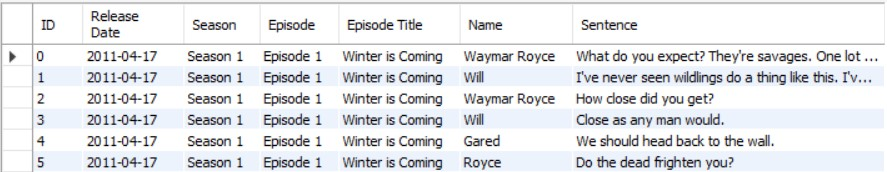
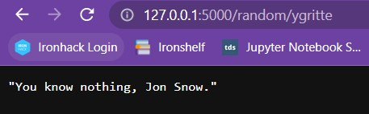
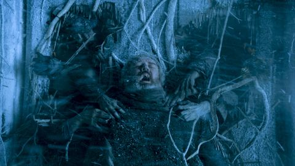

**Ironhack Project-4**

---
# Analysis of the Game of Thrones natural language using a local API

---

## 1- Main objective
- The main objective of this project was to build an API that retrieved information requested by the user. In this case, the database accessed by the API contained the script of the entire show of **Game of Thrones (GoT)**. 
- The database was loaded into MySQL workbench and the information was retrieved through different API endpoints that executed **SQL queries**. 
- In addition, the API retrieved the **natural language sentiment analysis** of the GoT script upon user request. The goal was to analyse the evolution of the characters throughout the series based on their language.

<br>

## 2- Structure of the API
The Game of Thrones script dataset was obtained from [Kaggle](https://www.kaggle.com/datasets/albenft/game-of-thrones-script-all-seasons). The script was very well curated and contained just a couple missing values. It is divided in seasons and episodes and each row represents a line sentence from a character:



The API was built using the **Flask** library in a local route. Find below the different endpoints of the API. Each endpoint retrieved the information of a corresponding query.  

**API endpoints:**

| **Endpoint** | **Information** |
| --- | --- |
| / | API docs \*under construction* |
| /top | Characters ordered by nº of sentences in the show |
| /random/\<name> | Random sentences of the specified character |
| **Retrieve scripts**  |  |
| /script | Script of the entire show |
| /script/character/\<name> | Script of a given character for the entire show, divided in seasons and episodes |
| /script/\<season>/ | Script of an entire season |
| /script/\<season>/character/\<name> | Script of a character for a given season divided in episodes |
| /script/\<season>/\<episode> | Script of a character for a given episode |
| /script/\<season>/\<episode>/\<name> | Script of a character for a given episode of a season |
| **Retrieve sentiment analysis (SA)** |
| /script/sa/character/\<name> | SA of a character for the entire show |
| /script/sa/\<season> | SA of an entire season |
| /script/sa/\<season>/mean/character/\<name> | Mean SA of a character for the entire show | 
| /script/sa/\<season>/meanstop/character/\<name> | Mean SA of a character for the entire show filtering out stop words |
| /script/sa/\<season>/\<episode> | SA of an entire episode of a season |
| /script/sa/\<season>/\<episode>/\<name> | SA of a character for a given episode of a season |
| /script/sa/\<season>/\<episode>/mean/character/\<name> | Mean SA of a character for a given episode of a season |
| /insertrow | Inserts a new row into the script dataset |

<br>

## 3- Queries

Examples of get and post request queries are shown below.

### 3.1- Get

The following query returns random sentences of your favorite Game of Thrones character.

```python
# API endpoint
@app.route("/random/<name>")
def random_from_character (name):
    if che.check_character(name):
        sentence = jsonify(sql.get_random(name))
        return sentence
    else:
        return "The specified character is not valid. Refer to our docs for the names of the characters."

# SQL query function executed at the API endpoint
def get_random (name):
    query = f"""SELECT Sentence 
    FROM got_script
    WHERE Name = '{name}'
    ORDER BY RAND()
    LIMIT 1;"""

    df = pd.read_sql_query(query, engine)
    sentence = df.to_dict(orient="records")

    return sentence[0]['Sentence']
```
It works! (Yes, I refreshed the page many times until I found it...)



### 3.2- Post

The following query inserts a new row into the script dataset.

```python
# API endpoint
@app.route("/insertrow", methods=["POST"])
def insert_row ():
    # Decoding params
    my_params = request.args
    id = my_params["ID"]
    release_date = my_params["Release Date"]
    season = my_params["Season"]
    episode = my_params["Episode"]
    episode_title = my_params["Episode Title"]
    name = my_params["Name"]
    sentence = my_params["Sentence"]

    # Passing to my function: do the insert
    sql.insert_one_row(id, release_date, season, episode, episode_title, name, sentence)
    return f"Query succesfully inserted"

# SQL query function executed at the API endpoint
def insert_one_row (id, release_date, season, episode, episode_title, name, sentence):
    query = f"""INSERT INTO got_script
     (ID, `Release Date`, Season, Episode, `Episode Title`, Name, Sentence) 
        VALUES ({id}, '{release_date}', '{season}', '{episode}', '{episode_title}', '{name}', '{sentence}');"""

    engine.execute(query)
    return f"Correctly introduced!"
```
A new character line was inserted into the database's table!


<br>

## 4- Sentiment analysis

The natural language sentiment analysis (SA) was performed using the **NLTK Sentiment Vader** library. 
- The result of the SA is a value called `compound` that summarizes and normalizes the amount of negative and positive words. This score takes values from -1 to 1, indicating maximum negativity and maximum positivity, respectively. 
- A sentence is considered **significantly** negative or positive if its compound value is lower than -0.05 or greater than 0.05, respectively. For clarification, positivity/negativity thresholds were drawn in the corresponding plots.


### 4.1- Main Game of Thrones characters based on the number of lines in the show

Before performing the SA, the main characters of the show and their sentence count were retrieved from the `/top` endpoint of the API. Not surprisingly, Tyrion Lannister ranked number one as the character with more sentences of the entire show, almost doubling the counts of his *beloved* siblings!


### 4.2- Comparing the presence and absence of stopwords in the SA

The sentiment analysis was performed before and after removing the so called *stop words*. These words are deemed insignificant in the natural language analysis. 
- In this particular case, the presence or absence of stop words didn't significantly change the outcome of the analysis. See below the evolution of Arya Stark's language over the eight seasons of the show, **with and without stopwords**.


### 4.3- Sentiment score of the top 20 main characters

The natural language was analysed for the 20 characters with more sentences in the show. 

- As seen in the graph, Petyr Baelish (*Littlefinger*), Varys (*the Spider*) and Davos ranked as the three top characters that frequent a positive language, which is related to their role as **councelors** in the series. The word cloud figures highlight the most repeated words by Petyr and Varys throughout the show. Notice how they use kind words such as *friend*, *good*, or *lord*.  

- In the opposite side of the plot we encounter Arya Stark and Theon Greyjoy, who appear as the two most negative main characters. Both of them went through very **traumatic** life experiences, which is reflected in the language they typically use.


### 4.4- Evolution of main characters throughout the show

Next, the sentiment compound of the four main characters was plotted over the different seasons. Interestingly, the language of **Jon** and **Cersei** seems to follow an **opposite** trend, while Daenerys and Tyrion's languages show spikes of positivity in the middle and by the end of the show, respectively.


A word cloud of these characters for the entire show is shown below:


### 4.5- Analysis of the most negative episodes

Next, the most *negative* episodes -in terms of language/script- were identified and their sentiment `compound` was plotted over the duration of the episode.


The episode **The Dragon and the Wolf** featured the discussion between the three main families of the series -Stark, Lannister and Targaryen- to evaluate the situation at The Wall concerning the *white walkers*. No wonder why the language used in that meeting, where the three families collided, was THAT *negative*.


On the other hand, the second most negative episode was **The Mountain and The Viper**. A closer inspection of the plot reveals a particularly negative spike by the end of the episode.


Turns out that this episode featured one of the most brutal scenes we have seen from the show. A hint (you know that the worst was yet to come and no one expected it):


### 4.6- Character evolution: Theon Greyjoy vs Ramsay Bolton

Finally, this last graph shows the evolution of Theon Greyjoy's and Ramsay Bolton's language. Ramsay kidnapped and tortured Theon, which correlates with an increased negativity sentiment in the language of Theon (season 3). Interestingly enough, after Ramsay's death and subsequent liberation of Theon in season 6, Theon's language evolves towards neutrality (*Dobby is free!*). 


### 4.7- BONUS

If you made this far you deserve a **Bonus!** Here is a word cloud of Hodor's transition to insanity. 


I'm sure you remember the actual scene:



<br>

### 5- Key documents

- `main.py` - python file for the local API/server.
- `sql_connection.py` (/src/config) - python file to connect to MySQL.
- `sql_queries.py` (/src/tools) - python file containing SQL query functions.
- `check_database.py` (/src/tools) - python file containing check functions (check if an inputed season/episode or name are valid; if not, the function returns a message).
- `main_queries.py` (/src/tools) - python file containing operation functions (loop queries, cleaning,...).
- `visualization.py` (/src/tools) - python file containing functions to build graphs.
- `requests.ipynb` (/src/tools) - jupyter notebook where the requests were performed.
- `output` folder (/src/tools) - contains the graphs from the analysis.