**Ironhack Project-4**

---
# An analysis of the Game of Thrones natural language using an in-house API
---
## 1- Main objective
- The main objective of this project was to build an API that retrieved information requested by the user. In this case, the database accessed by the API contained the script of the entire show of **Game of Thrones (GoT)**. 
- The database was loaded into MySQL workbench and the information was retrieved through different API endpoints that executed **SQL queries**. 
- In addition, the API retrieved the **natural language sentiment analysis** of the GoT script upon user request. The goal was to analyse the evolution of a character throughout the series based on its language.

## 2- Structure of the API
The API was built using the **Flask** library in a local route. Find below the different endpoints of the API. Each endpoint retrieved the information of a corresponding query.  

**API endpoints:**
| **Endpoint** | **Information** |
| --- | --- |
| / | API docs |
| /top | Characters ordered by nº of sentences |
| /random/\<name> | Random sentences of the specified character |
| **Show scripts** | 
| /script | Script of the entire show |
| ........ /character/\<name> | Script of a character for the entire show |
| ........ /\<season>/ | Script of an entire season |
| .................... /character/\<name> | Script of a character for a given season |
| .................... /\<episode>/\<name> | Script of a character for a given episode. If no name is specified returns the script of an entire episode of a season |
| ................................ /\<name> | Script of a character for a given episode of a season |
| **Show sentiment analysis (SA)** |
| ........ /sa/character/\<name> | SA of a character for the entire show |
| ................ /mean/character/\<name> | Mean SA of a character for the entire show | 
| ................ /meanstop/character/\<name> | Mean SA (filtering out stopwords) of a character for the entire show |
| .................... /\<season> | SA of an entire season |
| ................................ /\<episode> | SA of an entire episode of a season |
| ............................................ /\<name> | SA of a character for a given episode of a season |
| ............................................ /mean/character/\<name> | Mean SA of a character for a given episode of a season |
| /insertrow |

<br>
## 3- Queries

An examples of get and post request queries are shown below.

### 3.1- Get

```python
def get_random (name):
    query = f"""SELECT Sentence 
    FROM got_script
    WHERE Name = '{name}'
    ORDER BY RAND()
    LIMIT 1;"""

    df = pd.read_sql_query(query, engine)
    sentence = df.to_dict(orient="records")

    return sentence[0]['Sentence']
```

### 3.2- Post

```python
def insert_one_row (id, release_date, season, episode, episode_title, name, sentence):
    query = f"""INSERT INTO got_script
     (ID, `Release Date`, Season, Episode, `Episode Title`, Name, Sentence) 
        VALUES ({id}, '{release_date}', '{season}', '{episode}', '{episode_title}', '{name}', '{sentence}');"""

    engine.execute(query)
    return f"Correctly introduced!"
```
A new character line was inserted in the table's database!


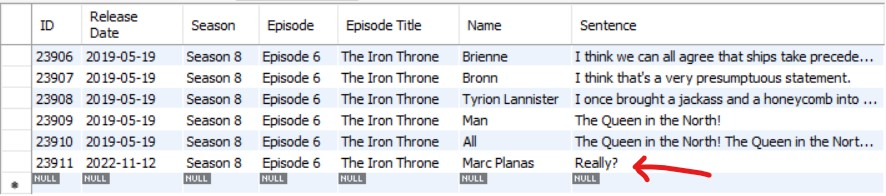

<br>

## 4- Sentiment analysis

The language sentiment analysis (SA) was performed using the **NLTK Sentiment Vader** library. 
- The result of the SA is a value called `compound` that normalizes the amount of negative and positive words. This score takes values from -1 to 1, from maximum negativity to maximum positivity, respectively. 
- A sentence is considered **significantly** negative or positive if its compound value is lower than -0.05 or greater than 0.05, respectively. For clarification, positivity/negativity thresholds were drawn in the corresponding plots.

<br>

**Main Game of Thrones characters based on the number of lines in the show**

Before performing the SA, the main characters of the show and their sentence count were retrieved from the `/top` endpoint of the API. Not surprisingly, Tyrion Lannister ranked number one as the character with more sentences of the entire show, almost doubling the counts of his *beloved* siblings!

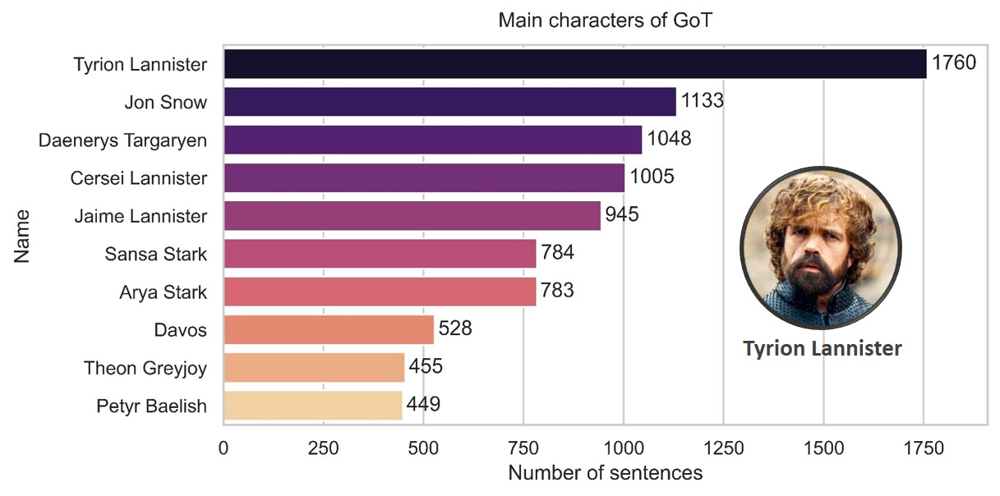

**Comparing the presence and absence of stopwords in the SA**

The sentiment analysis was performed before and after removing the so called *stop words*. These words are deemed insignificant in the natural language analysis. 
- In this particular case, the presence or absence of stop words didn't significantly change the outcome of the analysis. See below the evolution of Arya Stark's language over the eight seasons of the show.

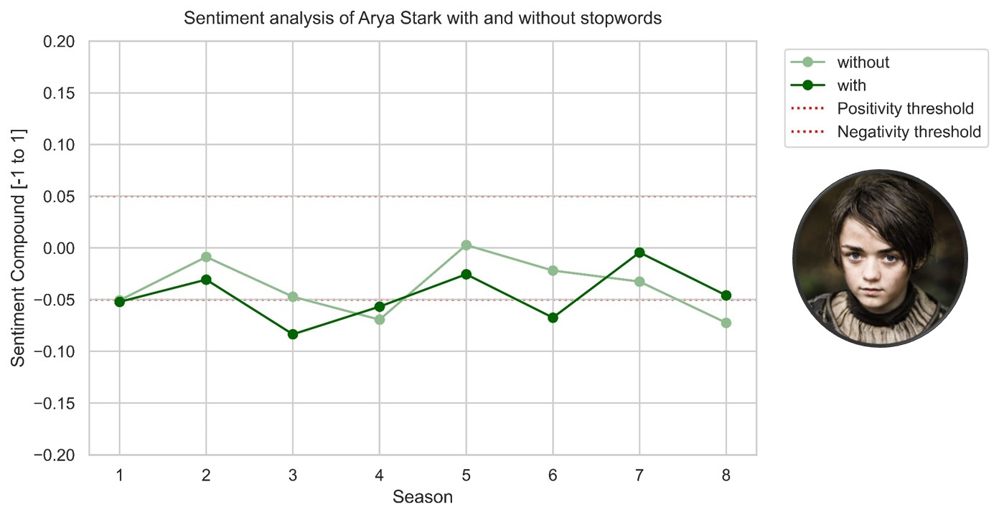

**Sentiment score of the top 20 main characters**

The natural language was analysed for the 20 characters with more sentences in the show. 

- As seen in the graph, Petyr Baelish (*Littlefinger*), Varys (*the Spider*) and Davos ranked as the three main characters that frequent a positive language, which is related to their role as **councelors**.  

- In the opposite side we encounter Arya Stark and Theon Greyjoy, who appear as the two most negative main characters. Both of them went through very **traumatic** life experiences, which is reflected in the language they typically use.

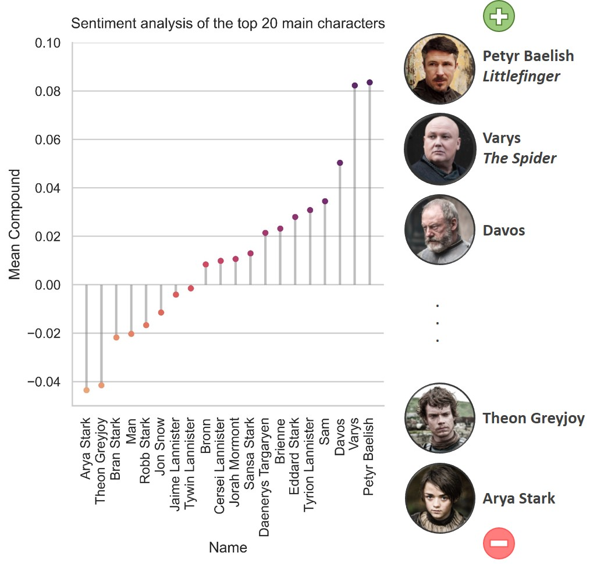

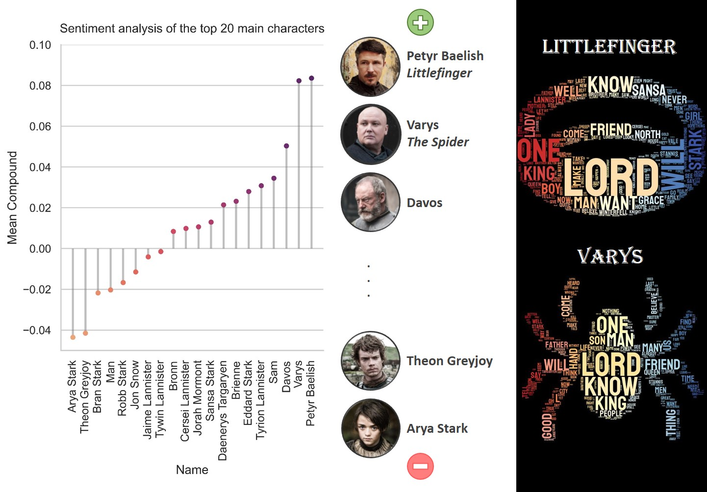

**Evolution of main characters throughout the show**

Next, the sentiment compound of the four main characters was plotted over the different seasons. Interestingly, the language of **Jon** and **Cersei** seems to follow an **opposite** trend, while Daenerys and Tyrion's languages show spikes of positivity in the middle and by the end of the show, respectively.

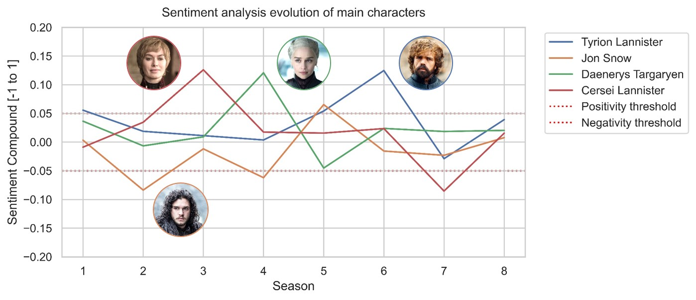

A word cloud of these characters is shown below:

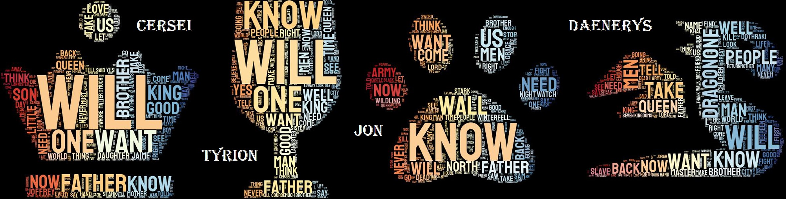

**Analysis of the most negative episodes**

A continuation, the most *negative* episodes -in terms of language used by the characters- were identified and their sentiment `compound` was plotted over the duration of the episode.

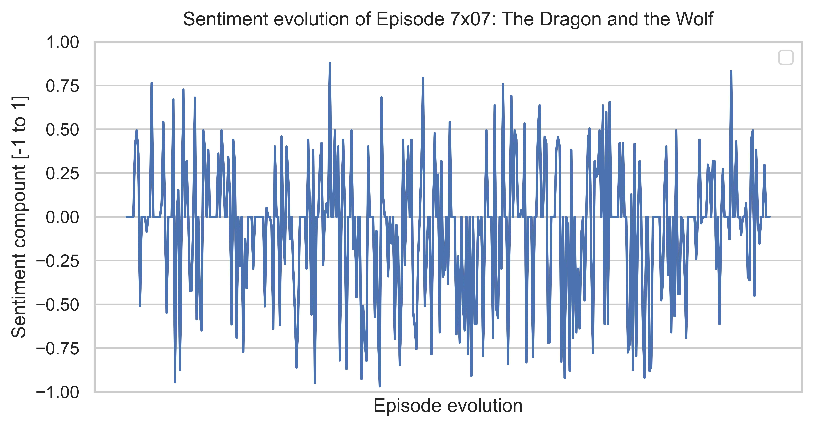

The episode **The Dragon and the Wolf** featured the discussion between the three main families of the series -Stark, Lannister and Targaryen- to evaluate the situation at The Wall concerning the *white walkers*. No wonder why the language used in that meeting were the three families collapsed was THAT *negative*.

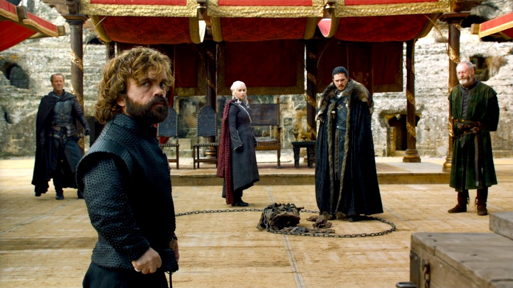

On the other hand, the second most negative episode was **The Mountain and The Viper**. A closer inspection of the plot reveals a particularly negative spike by the end of the episode.

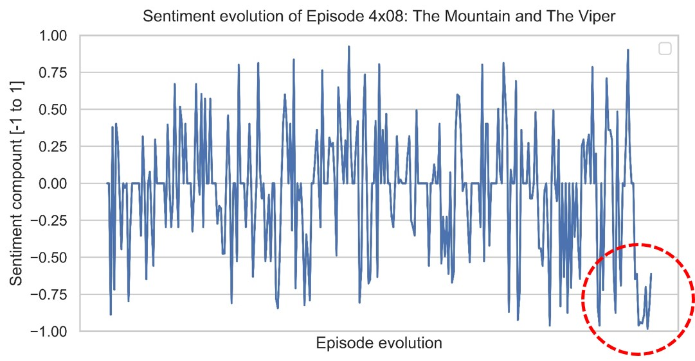

Turns out that this episode featured one of the most brutal scenes we have seen from the show. A hint:

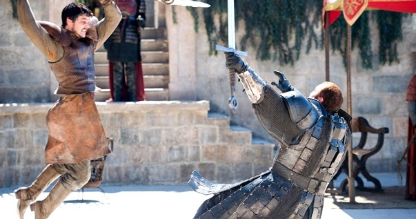

**Character evolution: Theon Greyjoy vs Ramsay Bolton**

Finally, the last graph shows the evolution of Theon Greyjoy's and Ramsay Bolton's language

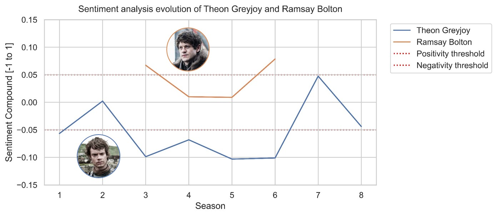

### 5- Key documents

-