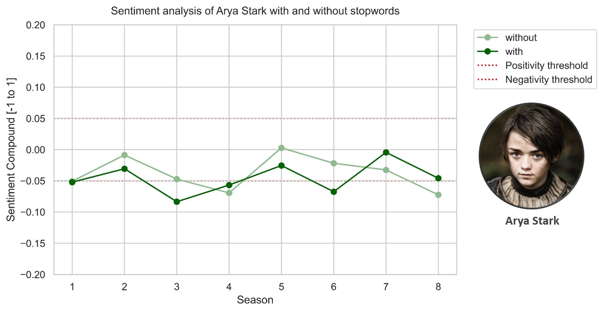

**Ironhack Project-4**

---
# API of Thrones 
#### An analysis of the Game of Thrones character language through a self-built API
---
## 1- Main objective
- The main objective of this project was to build an API that retrieved the information requested by the user. In this case, the database accessed by the API contained the script of the entire show of **Game of Thrones (GoT)**. 
- The database was loaded in MySQL workbench and the information was retrieved through different API endpoints that executed **SQL queries**. 
- In addition, the API retrieved the **language sentiment analysis** of the GoT script upon user request.

## 2- Structure of the API
The API was built using the **Flask** library in a local route. Find below the different endpoints of the API. Each endpoint retrieved the information of a corresponding query.  

**API endpoints:**
| **Endpoint** | **Information** |
| --- | --- |
| / | API docs |
| /top | Characters ordered by nº of sentences |
| /random/\<name> | Random sentences of the specified character |
| **Show scripts** | 
| /script | Script of the entire show |
| ........ /character/\<name> | Script of a character for the entire show |
| ........ /\<season>/ | Script of an entire season |
| .................... /character/\<name> | Script of a character for a given season |
| .................... /\<episode>/\<name> | Script of a character for a given episode. If no name is specified returns the script of an entire episode of a season |
| ................................ /\<name> | Script of a character for a given episode of a season |
| **Show sentiment analysis (SA)** |
| ........ /sa/character/\<name> | SA of a character for the entire show |
| ................ /mean/character/\<name> | Mean SA of a character for the entire show | 
| ................ /meanstop/character/\<name> | Mean SA (filtering out stopwords) of a character for the entire show |
| .................... /\<season> | SA of an entire season |
| ................................ /\<episode> | SA of an entire episode of a season |
| ............................................ /\<name> | SA of a character for a given episode of a season |
| ............................................ /mean/character/\<name> | Mean SA of a character for a given episode of a season |
| /insertrow |

<br>
## 3- Queries

An examples of get and post request queries are shown below.

### 3.1- Get

```python
def get_random (name):
    query = f"""SELECT Sentence 
    FROM got_script
    WHERE Name = '{name}'
    ORDER BY RAND()
    LIMIT 1;"""

    df = pd.read_sql_query(query, engine)
    sentence = df.to_dict(orient="records")

    return sentence[0]['Sentence']
```

### 3.2- Post

```python
def insert_one_row (id, release_date, season, episode, episode_title, name, sentence):
    query = f"""INSERT INTO got_script
     (ID, `Release Date`, Season, Episode, `Episode Title`, Name, Sentence) 
        VALUES ({id}, '{release_date}', '{season}', '{episode}', '{episode_title}', '{name}', '{sentence}');"""

    engine.execute(query)
    return f"Correctly introduced!"
```
A new row was inserted in the table's database!


<br>

## 4- Sentiment analysis

The language sentiment analysis (SA) was performed using the **NLTK Sentiment Vader** library. 
- The result of the SA is a value called `compound` that normalizes the amount of negative and positive words. This score takes values from -1 to 1, from maximum negativity to maximum positivity, respectively. 
- A sentence is considered **significantly** negative or positive if its compound value is lower than -0.05 or greater than 0.05, respectively. For clarification, positivity/negativity thresholds were drawn in the corresponding plots.

<br>

**Main GoT characters based on their number of lines**

Before performing the SA, the main characters of the show were retrieved from the `/top` endpoint.


<br>

- **Comparing the presence of stopwords in the SA**
After plotting the sentiment



- **Sentiment score of the top 20 main characters**

- **Evolution of main characters by season**

- **Most negative episodes**

-
-

- **Oberyn Martell vs The Mountain**

- **Theon Greyjoy vs Ramsay Bolton**

